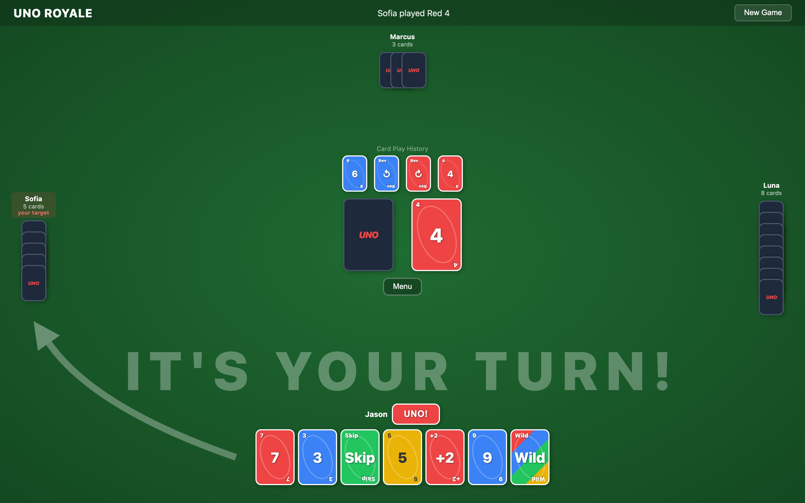
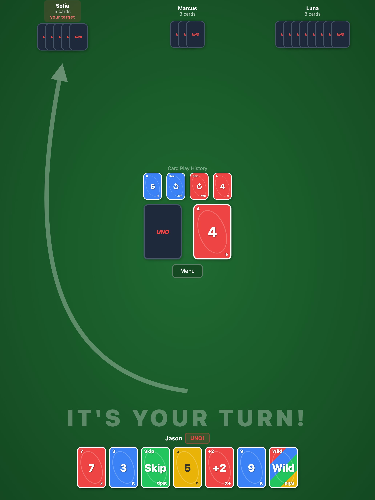
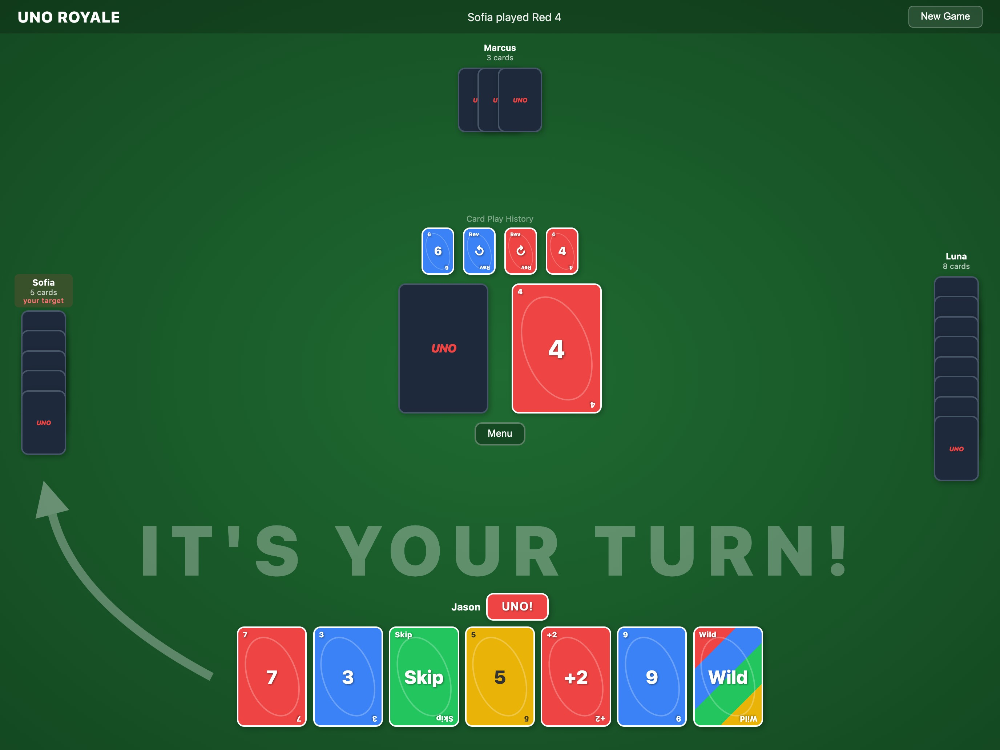
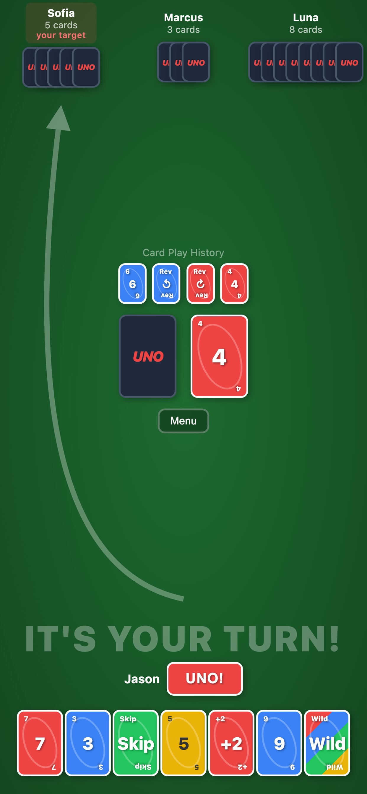
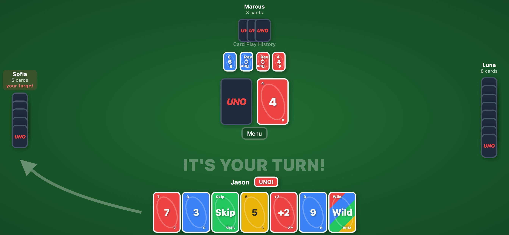

<p align="center">
  
</p>

<h1 align="center">Uno Royale</h1>

| Desktop |
| --- |
|  |

| iPad | iPad (Landscape) |
| --- | --- |
|  |  |

| iPhone | iPhone (Landscape) |
| --- | --- |
|  |  |

A single-player UNO card game built with Vue 3, TypeScript, and Vite. Play against three AI opponents with full UNO rules including Draw Two, Skip, Reverse, Wild, and Wild Draw Four cards.

## Features

- Classic UNO gameplay against 3 AI opponents
- AI opponents with randomized names from popular US baby names
- Card drag-and-drop reordering
- UNO call mechanic with penalty for forgetting
- Color chooser for Wild cards
- Animated card draws and plays
- Instant CPU mode for faster games
- Mobile-responsive layout
- iOS app via Capacitor (bundled WebView)

## Getting Started

```bash
npm install
npm run dev
```

## Scripts

| Command | Description |
|---------|-------------|
| `npm run dev` | Start Vite dev server |
| `npm run build` | Type-check and build for production |
| `npm run preview` | Preview production build |
| `npm run lint` | Run ESLint and Stylelint |
| `npm run cap:sync` | Build and sync to iOS project |
| `npm run cap:open` | Open iOS project in Xcode |

## iOS App

The game is wrapped as a native iOS app using [Capacitor](https://capacitorjs.com). All web assets are bundled locally — no server required.

```bash
npm run cap:sync    # build + copy assets to iOS
npm run cap:open    # open in Xcode
```

From Xcode, select a device or simulator and press Cmd+R to run.

## Tech Stack

- **Vue 3** with `<script setup>` and TypeScript
- **Vite** for dev server and bundling
- **Vitest** for unit testing the game engine
- **Capacitor** for the iOS native wrapper
